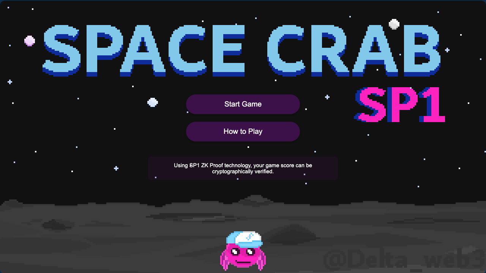
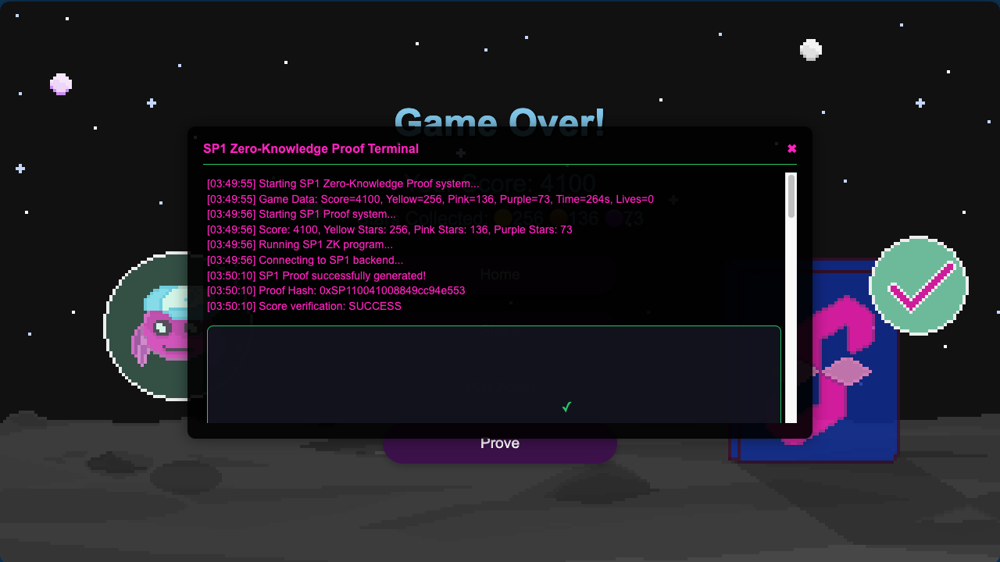

# Space Crab Game SP1 ZK Proof Integration

A WebAssembly crab game with SP1 zero-knowledge proof integration for cryptographic verification of game scores.




## Features

- Fun arcade-style crab game built with Rust and WebAssembly
- Collect stars of different values to gain points
- SP1 zero-knowledge proof system for cryptographic verification of game scores
- Power-ups: shields, double points, extra lives, and slow-down
- Gradually increasing difficulty

## Development

### Prerequisites

- Rust (with wasm-pack)
- Node.js
- SP1 toolchain

### Local Development

1. Clone the repository:

```bash
git clone https://github.com/d3lta02/space-crab.git
cd space-crab
```

2. Install SP1 tools (if not already installed):
```bash
curl -L https://sp1up.succinct.xyz | bash
sp1up
```

3. Build the WebAssembly code:
```bash
cd crab_game
wasm-pack build
```

4. Run the frontend:
```bash
cd www
npm install
npm start
```

5. In a separate terminal, run the backend:
```bash
cd backend
npm install
node server.js
```

6. Open your browser at `http://localhost:8080`

## How it Works

The game generates zero-knowledge proofs using SP1 to cryptographically verify that the player's score is valid according to the game rules. The proof generation happens on a backend server, with a fallback simulation mode when the backend is not available.

## Deployment

The game automatically runs in simulation mode when deployed on Vercel, as the SP1 backend is not available in that environment.

## License

MIT